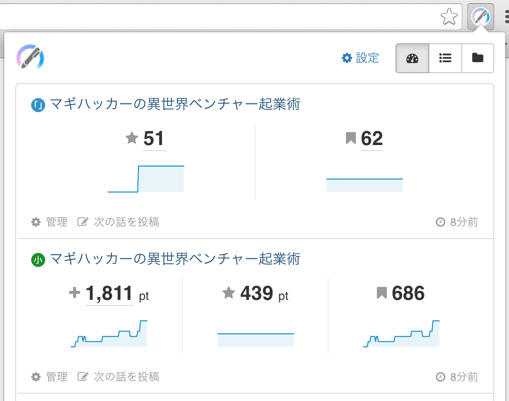
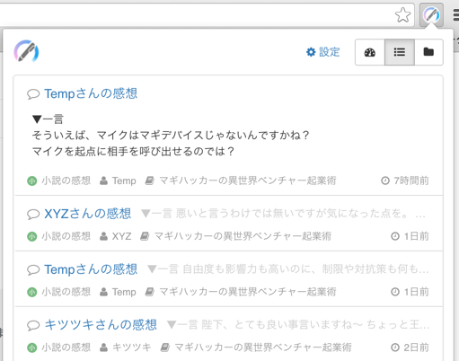

# Novelous Extension

[](https://app.wercker.com/project/bykey/49bea2b1aed53fb3fb3bb9dfec202111) [](https://github.com/semantic-release/semantic-release)


「小説家になろう」「カクヨム」などの小説サイトでの執筆作業をサポートする拡張機能です。

:information_source: 「小説家になろう」は株式会社ヒナプロジェクトの登録商標です。

## 機能

### 自分の作品のブックマーク数などをチェック



自分の作品への評価やブックマーク数などを記録して表示します。

#### 表示する項目

- 小説家になろう
    - 総合評価
    - 評価ポイント
    - ブックマーク数
- カクヨム
    - もらった★の数
    - フォロワー数

### 感想やレビューなどをその場で確認




自分の作品についた感想やレビューなどの内容を確認できます。（一部、本文がその場で読めないものもあります）

#### 確認できる項目

基本的に最新何件かのみの表示となります。

- 小説家になろう
    - 作品についた感想
    - 作品についたレビュー
    - 活動報告についたコメント
    - 受信したメッセージ（本文は確認できません）
- カクヨム
    - 作品についたレビュー
    - 近況ノートについたコメント（本文は一部しか確認できません）

### 新着の感想やコメントなどを通知


自分の作品についた感想やレビューなどの新着を、音とメッセージでお知らせします。

- お知らせする項目は確認できる項目と同様です。
- 設定で種類ごとに通知の ON/OFF が設定できます。

### (開発者向け) 各小説サイトの新規投稿画面を開く

:wrench: こちらの機能は開発者に向けたものとなっています。

以下のような JavaScript を localhost のページ上で実行すると、送信されたメッセージを元に各小説サイトの新規投稿画面に各情報を入力した状態で開きます。

gulp などのタスクランナーからの実行を想定しています。

```js
// Chrome 上で動いている拡張機能のID (拡張機能一覧に書かれている)
var extensionId = "mikejgecmcephkolbcfmlomnnlihhfch";

// このスクリプトが動いているタブを送信後に自動的に閉じる場合は true, 閉じない場合は false
var close = true;

// 小説情報
var title = "小説のタイトル";
var body = "小説の本文\n複数行でも大丈夫";

// 予約投稿する時間（予約投稿しない場合は null）
var time = "2016-03-28T18:00:00+0900";

// 「小説家になろう」の小説ID (小説管理画面 syosetu.com/usernovelmanage/top/ncode/XXXXX/ の XXXXX 部分)
var narouNovelId = "12345";

// 「カクヨム」の小説ID (小説ページ kakuyomu.jp/works/XXXXXXXX の XXXXXXXX 部分)
var kakuyomuNovelId = "12345678901234567890";

// のべらすにメッセージ送信
chrome.runtime.sendMessage(
    extensionId,
    {
        type: "PUBLISH_NOVEL",
        close: close,
        pubs: [
            {
                title: title,
                body: body,
                time: time,
                sites: {
                    narou: { novelId: narouNovelId },
                    kakuyomu: { novelId: kakuyomuNovelId }
                }
            }
        ]
    }
);
```

## 開発情報

### ビルド方法

    $ npm install
    $ npm run build

ビルドされた拡張機能は `dist/chrome` 内に生成されます。Chrome の拡張機能設定画面で「パッケージ化されていない拡張機能を読み込む」から、`dist/chrome` を指定する事で読み込めます。

### タスク

#### ビルド

すべてビルドして `dist` ディレクトリ以下に出力します。

	$ gulp

| オプション | 説明 |
| ---------- | ---- |
| `--watch` | ファイルの変更を監視して継続的にビルドします |
| `--production` | 本番向けにビルドします（minify などを行います） |
| `--verbose` | ログ出力を詳細にします |
| `--vendor` | 他のブラウザ向けにビルドします (chrome, moz, opera)  デフォルト: chrome |
| `--sourcemaps` | ソースマップを強制的に作成します. デフォルト: !production |

#### テスト

ユニットテストを実行します。

    $ npm test

ファイルの変更を監視して継続的なユニットテストを実行します。

    $ npm run test:watch

### リリース

[semantic-release](https://github.com/semantic-release/semantic-release) によるリリースの自動化を行なっています。

- バージョンは自動で決定されます。`package.json` および `manifest.json` の中の `version` はリリース時に設定されます。
- リリース時の git タグ作成、及びそのリリースノート作成はコミットメッセージによって自動で作成されます。
- [Wercker](https://app.wercker.com/project/bykey/49bea2b1aed53fb3fb3bb9dfec202111) によりコミットの度に自動テストが実行され、テストが通ればリリース用の zip ファイルが GitHub 上の Release として作成されます。（Chrome ウェブストアへのアップロード自体は @io-monad が手動で行なっています :persevere:）

### Contributing

Please read [CONTRIBUTING.md](CONTRIBUTING.md)

### License

MIT (See [LICENSE.txt](LICENSE.txt))
